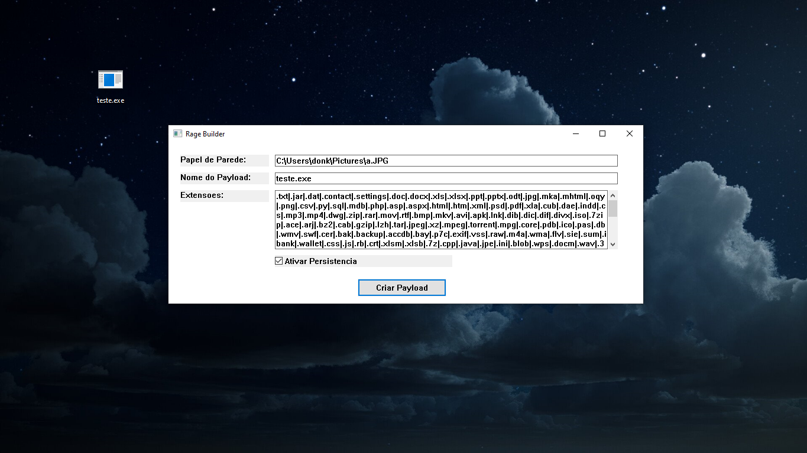
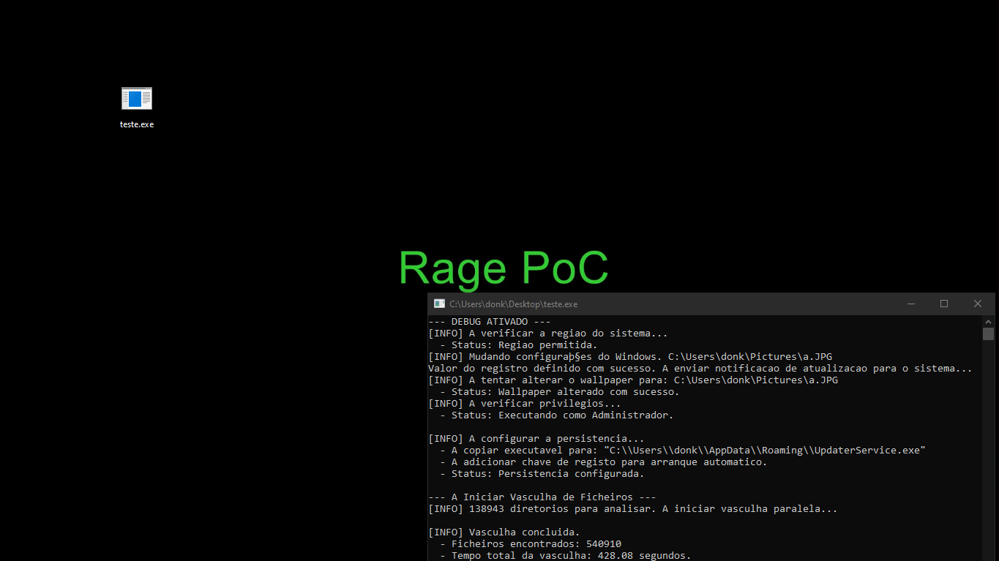
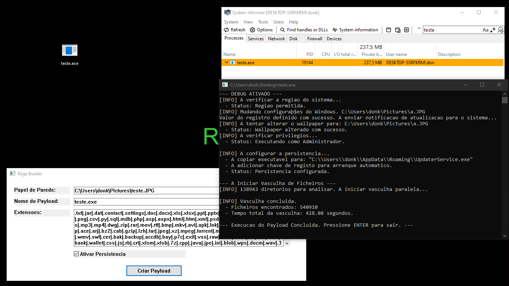
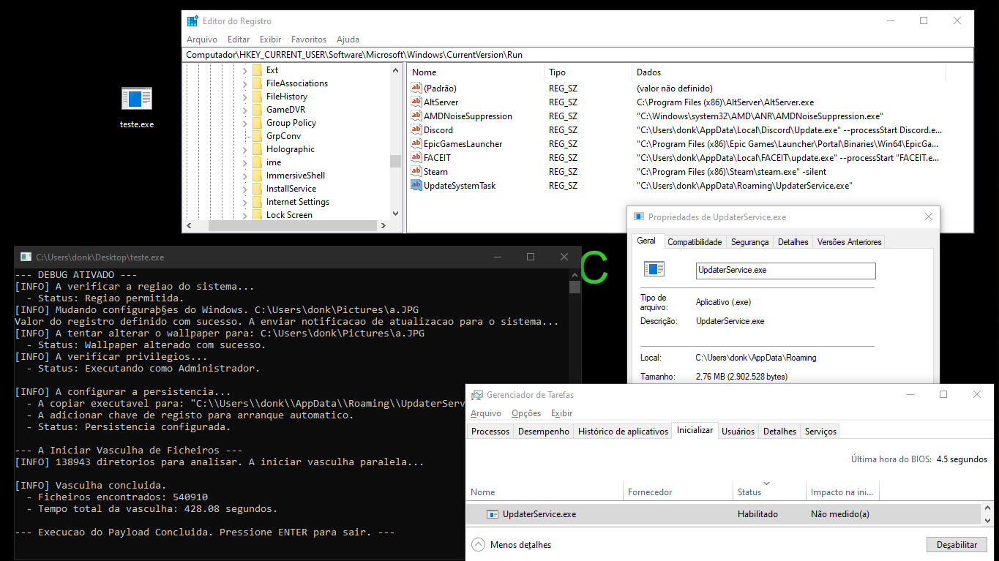

# Rage: Um Estudo de Caso de Red Team em Simulação de Ransomware

## 1. Introdução: A Mentalidade por Trás do Projeto

No domínio da segurança ofensiva, a emulação de adversários (Adversary Emulation) é uma das disciplinas mais desafiadoras. Não se trata apenas de explorar vulnerabilidades, mas de replicar a cadeia de ataque completa de um ator de ameaça. Como a "Ransomware Bible" articula, "Ransomware não é apenas um software malicioso que desarruma os seus ficheiros, é um ataque planeado, passo a passo.".

O projeto "Rage" nasceu da minha ambição de dissecar e implementar esta cadeia de ataque. O meu objetivo é construir uma Prova de Conceito (PoC) que me permitisse explorar em profundidade as Táticas, Técnicas e Procedimentos (TTPs) de um operador de ransomware moderno. Este é um projeto de Red Team, focado no desenvolvimento de ferramentas e na compreensão da mentalidade do atacante.

Este documento serve como um *white paper* técnico, detalhando as decisões de arquitetura, as proezas técnicas e as escolhas deliberadas que moldaram o Rage.

## 2. Arquitetura: Uma Abordagem Híbrida de Builder e Payload

Atores de ameaça profissionais não usam payloads com configurações fixas. A modularidade é chave. Inspirado em modelos de Ransomware-as-a-Service (RaaS) como o ransomwares modernos (HellCat, Alphv, etc...), projetei o Rage com uma arquitetura dual, mas com uma filosofia técnica distinta.

* **RaaS Tradicional (ex: HellCat):** Muitos RaaS usam uma abordagem de **compilação em tempo real**. O builder é uma GUI que gera um ficheiro de código fonte (ex: C#) personalizado e invoca o compilador para criar um payload único a cada vez. É flexível, mas lento e deixa um rasto de dependências (.NET Framework), porém, mais segura.
* **A Abordagem do Rage (Injeção de Recursos):** Optei por uma técnica mais alinhada com meu objetivo: rápida, leve e autónoma.
    1.  **O Builder:** Uma GUI nativa Win32 serve como o "painel de controle".
    2.  **O Payload:** O mesmo executável, quando "marcado", age como o agente ofensivo.

A geração do payload é um processo de modificação binária pós-compilação: o Builder faz uma cópia de si mesmo e injeta a configuração (formatada como uma string com `|` como delimitador) como um recurso binário (`CONFIG_DATA`) usando a função `UpdateResourceW` da API do Windows.

```cpp
// Trecho da lógica de distinção no ponto de entrada (rage.cpp)
int WINAPI wWinMain(HINSTANCE hInstance, HINSTANCE, PWSTR pCmdLine, int nCmdShow) {
    // A primeira ação é verificar a presença da "marca" de configuração.
    if (RunAsPayloadIfExists(pCmdLine)) {
        return 0; // Se a marca existe, executa como payload e termina.
    }
    // Caso contrário, inicia a interface do Builder.
    // ...
}
```

Esta arquitetura produz um payload nativo, sem dependências, e cujo comportamento é definido em tempo de execução, não em tempo de compilação.



## 3. Análise Técnica das TTPs Implementadas

Cada funcionalidade foi implementada para simular uma fase específica da cadeia de ataque de um ransomware.

### 3.1. Evasão de Defesas (Defense Evasion)

- `T1480.001 - Geo-Fencing`: Atores de ameaça frequentemente evitam alvos em certas jurisdições. Para simular isto, a primeira verificação do payload é na localidade do sistema. A minha função isForbiddenCountry usa a chamada GetUserDefaultLocaleName da API do Windows para obter o código de região (ex: "pt-BR") e compará-lo com uma lista de exclusão configurável.
```cpp
  bool FileScanner::isForbiddenCountry(const std::vector<std::wstring>& forbiddenLocales) {
    wchar_t localeName[LOCALE_NAME_MAX_LENGTH];
    if (GetUserDefaultLocaleName(localeName, LOCALE_NAME_MAX_LENGTH)) {
        for (const auto& forbidden : forbiddenLocales) {
            if (_wcsicmp(localeName, forbidden.c_str()) == 0) {
                return true; // Encontrou um país proibido
            }
        }
    }
    return false; // Não está num país proibido
}
```

### 3.2. Persistência e Escalonamento de Privilégios

- `T1547.001 - Chave de Registo Run`: Para a persistência, implementei a técnica clássica e fiável de criar uma entrada na chave de registo `HKEY_CURRENT_USER\Software\Microsoft\Windows\CurrentVersion\Run`. A função setupPersistence primeiro copia o payload para `%AppData%\UpdaterService.exe` para se misturar com o tráfego de aplicações legítimas, e depois usa `RegSetValueExW` para garantir a sua execução a cada logon. Embora eu tenha investigado métodos mais furtivos como o Persistence Via RegisterAppRestart Shim (que abusa da API de reinício de aplicações do Windows), optei pela chave Run como uma base sólida e, mais importante, para a proteger com a técnica seguinte.
```cpp
        HKEY hKey;
        const wchar_t* regPath = L"Software\\Microsoft\\Windows\\CurrentVersion\\Run";
        if (RegOpenKeyExW(HKEY_CURRENT_USER, regPath, 0, KEY_SET_VALUE, &hKey) == ERROR_SUCCESS) {
            std::wcout << L"  - A adicionar chave de registo para inicialização." << std::endl;
            std::wstring value = L"\"" + destPath.wstring() + L"\"";
            RegSetValueExW(hKey, L"UpdateSystemTask", 0, REG_SZ, (const BYTE*)value.c_str(), (value.size() + 1) * sizeof(wchar_t));
            RegCloseKey(hKey);
            return true;
        }
  ```

- `T1222.001 - Modificação de Permissões (ACL Hijacking)`: Simplesmente alterar uma política no registo é fraco. Um operador competente garante que as suas alterações não podem ser revertidas. A minha função lockRegistryKey implementa isto para o bloqueio do Painel de Controle.

Após definir `NoControlPanel=1`, o programa usa a API de Segurança do Windows `(aclapi.h)`.
Constrói uma regra de acesso `(EXPLICIT_ACCESS)` que NEGA `(DENY_ACCESS)` as permissões de escrita `(KEY_SET_VALUE, DELETE)` para o grupo "Todos" (Everyone).
Aplica esta nova Lista de Controle de Acesso (ACL) à chave com `SetNamedSecurityInfoW`.
O resultado é que nem mesmo um `regedit.exe` a correr como Administrador consegue modificar a chave, cimentando a nossa alteração de configuração.

### 3.3. Descoberta (Discovery)

- `T1083 - Descoberta de Ficheiros e Diretórios`: O sucesso de um ransomware depende da sua capacidade de encontrar rapidamente todos os dados valiosos. O desempenho é tudo.

Resultado do Teste: O módulo de vasculha do Rage analisou 1.5 TB de dados, identificando 138,943 diretórios e encontrando 540,688 ficheiros alvo em apenas 428.08 segundos (~7.6 minutos).



#### A Lógica da Leitura Eficiente (Paralelismo Padrão do C++17):
- Para alcançar esta performance, descartei abordagens manuais de threading em favor da implementação de alto nível do C++17, conforme discutido no documento "C++ Standard Parallelism". Como o documento afirma, "o paralelismo padrão do C++ integra-se perfeitamente com a STL existente, tornando-o intuitivo... [e] minimiza o risco de bugs comuns de multithreading, como data races e deadlocks."

#### A minha implementação startParallelScan funciona em duas fases:
- **Fase de Recolha**: Uma função recursiva rápida, `collectDirectories`, percorre todas as drives `(GetLogicalDriveStringsW)` e constrói um `std::vector` com o caminho de todos os diretórios do sistema.
- **Fase de Execução Paralela**: Com a lista completa de tarefas, utilizo o algoritmo `std::for_each` com a política `std::execution::par`.

```cpp
    // A chamada principal para a vasculha paralela em file_scanner.cpp
    std::for_each(
        std::execution::par, // Pede à biblioteca para dividir o trabalho
        allDirsToScan.begin(),
        allDirsToScan.end(),
        [this](const std::filesystem::path& dir) {
            scanSingleDirectory(dir);
        }
    );
```

A biblioteca padrão encarrega-se de agendar e distribuir a análise de cada diretório pelos núcleos de CPU disponíveis. Cada thread executa scanSingleDirectory, e o acesso à lista final de resultados foundFiles é sincronizado com um std::mutex para garantir a integridade dos dados.

### 3.4. Impacto

- `T1491.001 - Defacement Interno`: Como um sinal claro de comprometimento, o payload altera o wallpaper do ambiente de trabalho. A minha função setWallpaper usa `SystemParametersInfoW`. Para garantir que a alteração é imediata, a chamada é seguida da notificação de broadcast `WM_SETTINGCHANGE`, que força o explorer.exe a recarregar as suas configurações em tempo real.



### 3.5. A Omissão Deliberada da Criptografia (T1486)

A lista de mais de 500,000 ficheiros gerada pelo módulo de Descoberta é o ponto exato onde um ator de ameaça real executaria o seu módulo de encriptação (o "locker"). Deliberadamente, optei por não implementar qualquer funcionalidade de encriptação.

Do ponto de vista de um projeto de Red Team, o meu objetivo era focar-me na engenharia das fases que permitem o acesso, a persistência e a descoberta em larga escala. A criptografia em si é um problema algorítmico já resolvido. O verdadeiro desafio, e o foco deste projeto, está nas táticas que garantem que o "locker" consegue ser executado no maior número de ficheiros possível, o mais rapidamente possível. O Rage termina após a descoberta, provando que o reconhecimento para um ataque de larga escala foi concluído com sucesso.

## 4. Funcionalidades Potenciais (Táticas de Atores Reais)

Este PoC serve como uma base sólida. Um ator de ameaça real expandiria as suas capacidades com TTPs adicionais, como:

- Atraso Antes da Encriptação (Delay before encrypting): Para evadir sandboxes e maximizar o dano.
- Desativação do Gestor de Tarefas (Disable Task Manager): Para impedir a terminação manual do processo.
- Eliminação de Cópias de Sombra (Delete Shadowcopies): Usando vssadmin.exe para destruir os backups automáticos do Windows.
- Encriptação AES-RSA: O módulo de encriptação híbrida.
- Autodestruição (Auto destruction): Para dificultar a análise forense.
- Movimento Lateral & Dumping de Credenciais: O comprometimento de uma única máquina raramente é o objetivo final. O verdadeiro prémio está na rede corporativa. Um ator de ameaça usaria o ponto de entrada inicial como um pivô para se mover lateralmente
-  Evasão de Análise:  A primeira coisa que um payload sofisticado faz é verificar o seu ambiente. Se detetar que está a ser executado numa Máquina Virtual (VM) ou numa sandbox de análise (usada por investigadores de segurança), ele termina a sua execução imediatamente ("morre") ou altera o seu comportamento para parecer benigno

## 5. Conclusão

O desenvolvimento do "Rage" foi um exercício de emulação de adversário, um mergulho profundo na mentalidade de um atacante. Através da implementação de TTPs conhecidas em C++ moderno e da API Win32, pude não só explorar as complexidades do desenvolvimento de ferramentas ofensivas, mas também focar-me em aspetos críticos como a performance e a evasão de defesas. Este projeto demonstra a minha capacidade de arquitetar software complexo, gerir a concorrência de threads, interagir com APIs de baixo nível do sistema operativo e, acima de tudo, pensar como um Red Teamer na construção de ferramentas para simulação de ataques.



## 6. Recursos de Pesquisa

* **The Ransomware Operator Bible:** https://klydz.net/all/How-ransomware-operators-operate/

* **MITRE ATT&CK® Framework:**  https://attack.mitre.org/

* **Microsoft Learn:** https://learn.microsoft.com/en-us/windows/win32/api/

* **C++ Standard Parallelism - Southern Methodist University:** https://southernmethodistuniversity.github.io/parallel_cpp/cpp_standard_parallelism.html
